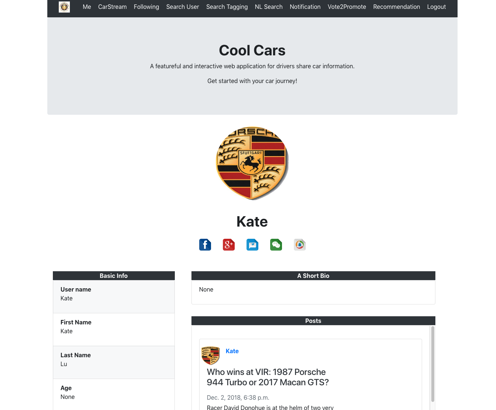

# 95882 Final Project -- Cool Cars Website

-----------------

A featureful and interactive web application for drivers share car information. 

Get started with your car journey!

## Introduction & Demo ##

1. Login/Signup +10pts

	1.1 Signup / Registration
	
	
	
	1.2 Login
	
	

2. Submit AND Read content +15pts

	* Post stream
	
	
	
	* My Profile
	
	
	* Follow other users
	
	
	In the following stream, you can view the contents from the users you followed
	
	
	
3. Search for content and display +15pts
   Be sure to have an answer about how you sort the results.
   
   You can search user posts by type in their usernames with colon seperation.
   
   *  Sort post upvotes
   
   
   * 	Sort user likes
   Sort: This result has been sorted by the number of vote of each user. The user with higher vote will be displayed first.
   
   
   
4. Home page WITH Immediate Immersion (aka Lazy Signup) +5pts

 	Without log into our website, you can view user posts.
 	
	

5. Badges OR Notifications OR Dashboard +5pts

	In the notification page, the website will display the notifications u've not read yet. By clicking on mark as read, this piece of notification will not display again.
	
	
	
6. Vote to Promote +5pts
   Remember that it modifies Search sort results
   
   The vote number will affect Search User page.
   
   
   
7. Favorites +5pts
	Be sure to show how it also modifies Search sort results
	
	You can favorite a post. The post stream will automatically update according to the number of favorite of each post.
	
	
	
	
8. Tagging (in general or of favorites) +5pts
	Show how it expands the Search results
	Tags are entered by OTHER users, not the person doing the post
	
	Anyone can tag any post.
	
	
	
9. Natural Language Interface to Search +5pts

	

10. Suggestions +5pts
	EITHER related content OR recommendations 
	Show your external program and how it works.
	
	

## Backend ##
* Django 2.1.3

* Python 3.6

* Database: Sqlite3

* Supportive Packages:
	* cachetools	3.0.0	
	* django-taggit	0.23.0	
	* django-widget-tweaks	1.4.3
	* gsearch	1.6.0	
	* httplib2	0.12.0	
	* protobuf	3.6.1
	* pyasn1	0.4.4	
	* pyasn1-modules	0.2.2
	* pytz	2018.7	
	* rsa	4.0	
	* setuptools	39.1.0	
	* six	1.11.0	
	* Whoosh	2.7.4
	* django-haystack	2.8.1	

## Instruction ##

* Install Django on your machine. You can find instruction here:

	[Django Quick install guide](https://docs.djangoproject.com/en/2.1/intro/install/)
	

* Open mysite project and use `cd` navigate to the directory where manage.py file is located.

* Activate virtual environment: `. venv/bin/activate`

* pip install all required packages:

	* `pip install cachetools	3.0.0`
	* `pip install django-taggit	0.23.0	`
	* `pip install django-widget-tweaks	1.4.3`
	* `pip install gsearch	1.6.0	`
	* `pip install httplib2	0.12.0	`
	* `pip install protobuf	3.6.1`
	* `pip install pyasn1	0.4.4	`
	* `pip install pyasn1-modules	0.2.2`
	* `pip install pytz	2018.7	`
	* `pip install rsa	4.0	`
	* `pip install setuptools	39.1.0	`
	* `pip install six	1.11.0	`
	* `pip install 	Whoosh	2.7.4`
	* `pip install 	django-haystack	2.8.1`

* Migrate Database:

* Run project `python manage.py runserver`

* Go to http://127.0.0.1:8000 to view cool cars Website!

